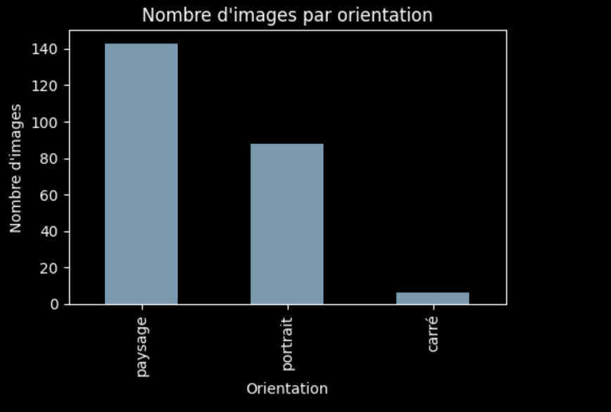
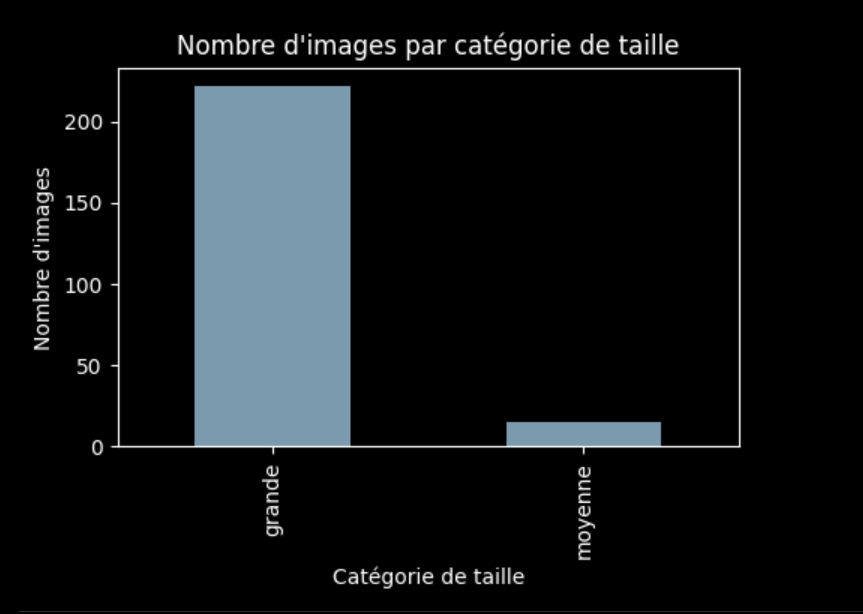
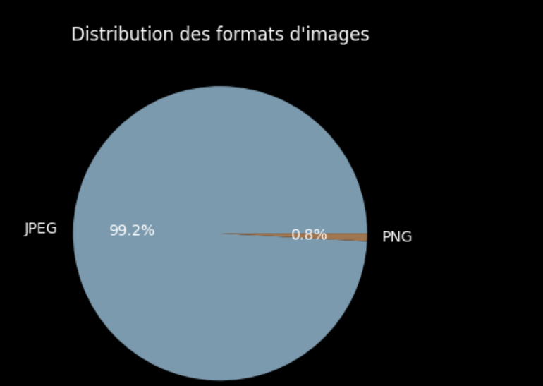
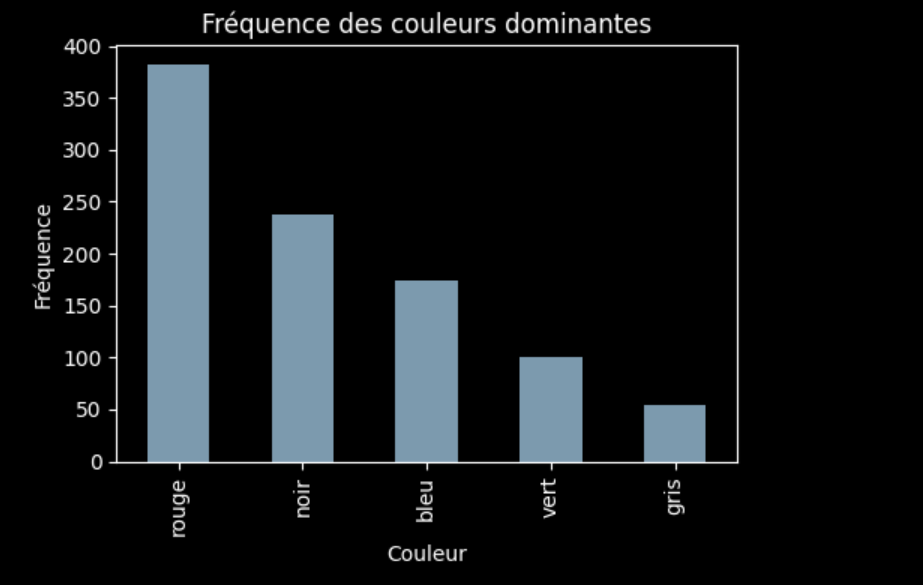

# Rapport de synthèse – Système de recommandation d’images

## 1. Introduction

L’objectif de ce projet est de construire un système simple de recommandation d’images. Le principe est de collecter automatiquement des images, d’en extraire quelques caractéristiques utiles, puis de proposer de nouvelles images adaptées aux préférences d’un utilisateur.

Le projet suit une chaîne de traitement complète : collecte des images via Wikimedia Commons, annotation à partir des métadonnées et du contenu visuel, simulation de profils utilisateurs, puis génération de recommandations. L’idée n’est pas de produire un système industriel, mais un prototype cohérent qui illustre les notions de collecte, prétraitement, clustering et recommandation vues en cours.

## 2. Collecte de données

Les images ont été récupérées à partir de l’API de Wikimedia Commons, qui fournit des images libres de droits avec des métadonnées structurées. Les requêtes ont porté sur plusieurs thèmes simples (`cat`, `dog`, `mountain landscape`) afin d’obtenir un jeu de données varié, combinant animaux domestiques et paysages.

Au total, un peu plus d’une centaine d’images exploitables ont été téléchargées après filtrage des fichiers non images et gestion du rate limiting. Les métadonnées sont stockées dans un fichier `images_metadata.json`. Pour chaque image, on conserve :

- Le nom de fichier local
- La largeur et la hauteur en pixels
- Le format et la taille du fichier
- L’URL source et la licence
- La source (Wikimedia Commons)
- Le thème d’origine de la recherche

Ces informations servent de base aux étapes d’annotation et d’analyse.

## 3. Méthodologie

### 3.1 Étiquetage des images

À partir de `images_metadata.json`, chaque image est enrichie avec des caractéristiques plus interprétables, stockées dans `images_labels.json`.

- **Orientation** : calculée à partir du rapport largeur/hauteur (paysage, portrait, carré).
- **Catégorie de taille** : vignette, moyenne ou grande, en fonction de la dimension maximale.
- **Couleurs dominantes** : extraites par KMeans sur les pixels RGB d’une version réduite de l’image. Les centroïdes sont interprétés comme couleurs dominantes.
- **Noms de couleurs** : conversion des RGB en noms simples (`rouge`, `bleu`, `vert`, `gris`, `noir`) selon la composante dominante et la luminosité.
- **Tags** : dérivés du thème de recherche (par exemple `chat`, `chien`, `montagne`, `paysage`, `animal`).

Cette étape fournit, pour chaque image, une description compacte qui sera utilisée pour construire les profils utilisateurs et alimenter l’algorithme de recommandation.

### 3.2 Profils utilisateurs

Cinq profils utilisateurs simulés ont été construits pour tester le système. Chaque utilisateur est défini par une liste d’images favorites, choisies de façon cohérente avec un certain goût (par exemple images rouges en paysage, images bleues en portrait, grandes images, petites vignettes, goûts mixtes).

À partir de ces favoris, un profil est calculé automatiquement et stocké dans `users.json` :

- Couleurs les plus fréquentes dans les images favorites
- Orientation dominante
- Catégorie de taille dominante
- Tags les plus fréquents
- Liste des images favorites

Ces profils résument les préférences de chaque utilisateur et servent d’entrée au module de recommandation.

### 3.3 Clustering et recommandation

Pour rapprocher les images entre elles, un clustering KMeans est appliqué. Chaque image est représentée par :

- Sa couleur principale
- Son orientation
- Sa catégorie de taille
- Son tag principal

Ces variables catégorielles sont encodées, puis utilisées pour entraîner un KMeans avec un nombre réduit de clusters. Chaque image reçoit un identifiant de cluster, ce qui regroupe, de manière simple, des images visuellement proches.

L’algorithme de recommandation est hybride :

1. Pour un utilisateur donné, on identifie les clusters les plus présents dans ses images favorites.
2. Les images candidates sont choisies parmi ces clusters, en excluant les favoris existants.
3. Un score est attribué à chaque candidate en fonction du recouvrement entre ses couleurs dominantes et les couleurs favorites de l’utilisateur.
4. Les meilleures images sont sélectionnées et renvoyées, avec une courte explication (couleurs communes, orientation, taille, cluster).

Cette approche combine une vision « globale » via le clustering et une personnalisation via les préférences de l’utilisateur.

## 4. Résultats

Plusieurs visualisations ont été produites pour analyser la collection d’images et les profils utilisateurs. On peut notamment représenter :

- La répartition des orientations (paysage, portrait, carré)

- La répartition des catégories de taille

- La distribution des formats d’image

- La fréquence des couleurs dominantes

- Les couleurs présentes dans les favoris de chaque utilisateur

Les recommandations ont été évaluées de manière qualitative. Pour plusieurs utilisateurs, les images proposées partagent visiblement des caractéristiques avec leurs favoris : même type de scène, couleurs proches, orientation et taille similaires. Des tests automatiques vérifient également que la fonction de recommandation renvoie le nombre attendu de résultats et qu’aucune image favorite n’est recommandée à nouveau.

## 5. Limitations et travaux futurs

Le système présente plusieurs limites. Le jeu de données reste de taille modeste et limité à quelques thèmes. Les descripteurs sont simples et ne capturent pas toute la richesse visuelle des images. De plus, les profils utilisateurs sont simulés, donc il n’y a pas d’évaluation basée sur de vrais retours.

Plusieurs pistes d’amélioration sont possibles :

- Étendre et diversifier le jeu de données
- Enrichir les tags à partir des descriptions textuelles
- Utiliser des descripteurs visuels plus avancés (embeddings de réseaux de vision)
- Tester des approches de filtrage collaboratif avec de vrais utilisateurs

## 6. Conclusion

Ce projet met en place un pipeline complet de recommandation d’images : collecte automatique sur Wikimedia Commons, extraction de métadonnées, annotation, construction de profils utilisateurs, clustering et recommandation hybride. Malgré des choix de modélisation volontairement simples, le système produit des recommandations cohérentes avec les profils définis.

Le travail réalisé illustre concrètement plusieurs notions de data mining et d’apprentissage automatique vues en cours. Il constitue une base solide qui pourrait être enrichie par des descripteurs plus puissants, des données plus nombreuses et une validation sur des utilisateurs réels.
